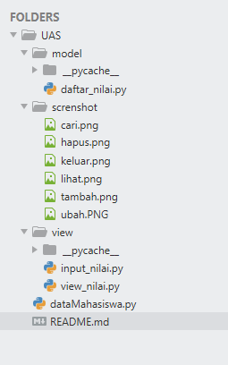

# UAS
Ujian Akhir Semester 
<b>File Data Mahasiswa</b>   pada pengerjaan UAS ini saya menggunakan Text Editor Sublime Text 3 

 
<b>Instansiasi Objek</b>  
Untuk membuat objek dari sebuah class, maka kita dapat memanggil nama class dengan argumen sesuai dengan fungsi __init__() pada saat kita mendefinisikannya. 

 
<b>Mengakses Attribut Objek</b>  
Langkah terakhir adalah mengakses atribut objek dengan menggunakan operator titik. Variabel kelas bisa diakses dengan menggunakan nama kelasnya. 

 
<b>Hasilnya:</b> 

