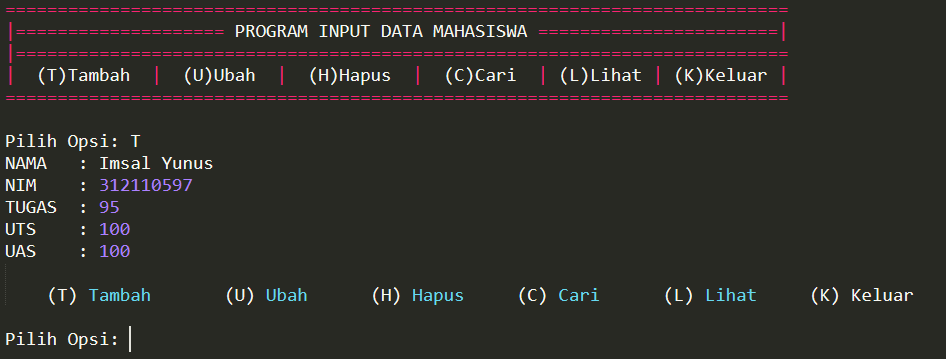

# UAS
Ujian Akhir Semester 
<b>Isi Folder</b>   pada pengerjaan UAS ini saya menggunakan Text Editor Sublime Text 3 
   
<b>Output tambah_data</b>  
   
<b>Output lihat_data</b>  
   
<b>Output ubah_data</b>  
   
<b>Output cari_data</b>  
   
<b>Output hapus_data</b>  
   
<b>Output break_data</b>  

