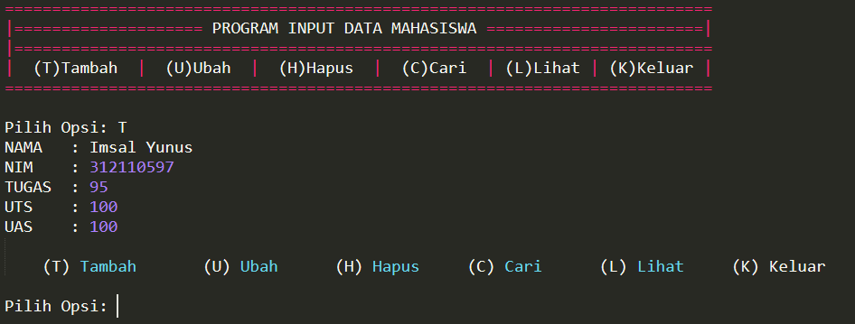
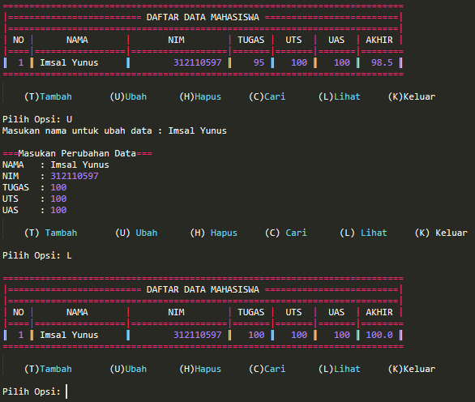

# UAS
Ujian Akhir Semester 
<b>Isi Folder</b>   pada pengerjaan UAS ini saya menggunakan Text Editor Sublime Text 3 

 
daftar_nilai.py berisi modul untuk :
- tambah_data
- ubah_data
- hapus_data
- cari_data
 
 
view_nilai.py berisi modul untuk :
- cetak_daftar_nilai
- cetak_hasil_pencarian
 
 
input_nilai.py berisi modul untuk :
- input_data (yang meminta pengguna memasukkan data).
 
 
dataMahasiswa.py berisi program utama (menu pilihan yang memanggil semua menu yang ada).
 
 <b>Output tambah_data</b> 

  
 <b>Output daftar_data</b> 

  
 <b>Output ubah_data</b> 

  
 <b>Output cari_data</b> 

  
 <b>Output hapus_data</b> 

  
 <b>Output break</b> 

  
